## 欢迎使用 xasset-7.0

xasset-7.0 是快速、强大的 Unity 资源系统。

它主要为 Unity 项目的包体大、打包慢、边玩边下、运行卡顿等疑难杂症提供全面有效的解决方案。

## 新变化

对比上一个 6.1 版本，xasset-7.0 的主要改动如下：

- 全新的分布式分包打包配置和工具，可以轻易驾驭 10w +量级资源的分布式打包支持。
- 更精炼的代码结构，根据 Rider 统计目前编辑器+运行时大约 4800 行代码，大约比之前少了 2000 行代码。
- 使用 json 格式生成清单文件和清单的版本文件，去掉了之前旧的清单序列化和反序列相关内容。
- 代码直接放在 Assets 目录，方便开发。

### 运行时

- Versions.DownloadAsync 操作底层改成 one by one 的下载机制，下载出错时可以更灵敏的进行错误返回，并增加了 updated 事件，方便业务开发。
- Versions.GetDownloadSizeAsync 改成只支持通过资源路径批量检查更新大小的实现。
- 增加 BundledAssets 序列化对象类，用来记录资源列表，可以进行备注，并提供了可以通过拖拽的方式批量添加资源的编辑器扩张。
- 使用 ManifestAsset 接管了本地和服务器的清单加载逻辑，删除了旧的 DownloadManifestFile & BuiltinManifestFile。
- 对 Download 组件的异常处理能力进行了强化，修复了 crc 校验在多线程环境中可能出现异常的情况，并增加了 updated 事件，方便业务开发。
- Scene、Download、UnpackBinary、DownloadQueue 等类增加了 updated 事件，方便业务开发，并去掉了 SceneObject 相关内容。

### 编辑器

- 增加 Record 记录每次 Build 新增的文件，BuildScript.postprocessBuildBundles 会返回这个对象，业务可以将这个对象的 files 的内容上传到服务器。
- 提供新的可序列化对象 Build 类处理打包的资源采集、依赖分析、自动分组、二级制合并等操作，可以更轻松的处理 数十万资源量级项目的分布式打包配置。
- 简化 BundleMode，目前只提供了 5 种常用的打包模式：PackTogether、PackByFile、PackByDirectory、PackByTopDirectory、PackByRaw。
- 提供了新的打包 Group 配置，支持更灵活的筛选、启用、是否分析依赖等选项，对不带依赖的资源关闭依赖分析可以加快打包速度。
- 提供了新的编辑器打包工具菜单选项，具体参考 Assets/Build 一栏 和 Assets/Create/Versions 一栏。
- bundle 名字支持保留目录格式。

### 示例

- 适配了 7.0 的 API 的版本。

## 功能特性

- 增量打包：分布式、分包，支持自动分组，10W 贴图 10 分钟打包好。
- 边玩边下：增量按需更新，断点续传、带宽可控、轻松查询速度和大小。
- 简明加载：统一使用相对路径加载资源，支持短链接，依赖管理无烦恼。
- 稳定可靠：使用引用计数进行内存管理，不重复加载、进多少、出多少。
- 流畅运行：异步实例化、异步渐进式回收...超时处理可自动分帧平滑如丝。
- 灵敏迭代：支持仿真模式、预加载模式、增量模式，编辑器可以和真机无缝切换。
- 兼容广泛：支持 Android、iOS、WebGL、PC、OSX 等平台。

## 示例

xasset-7.0 的示例主要包含以下特性的演示：

1. 分布式、分包打包配置（完整资源、不带资源、部分资源）

   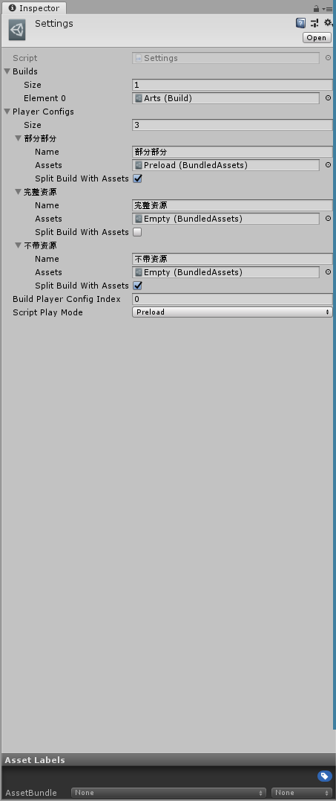
   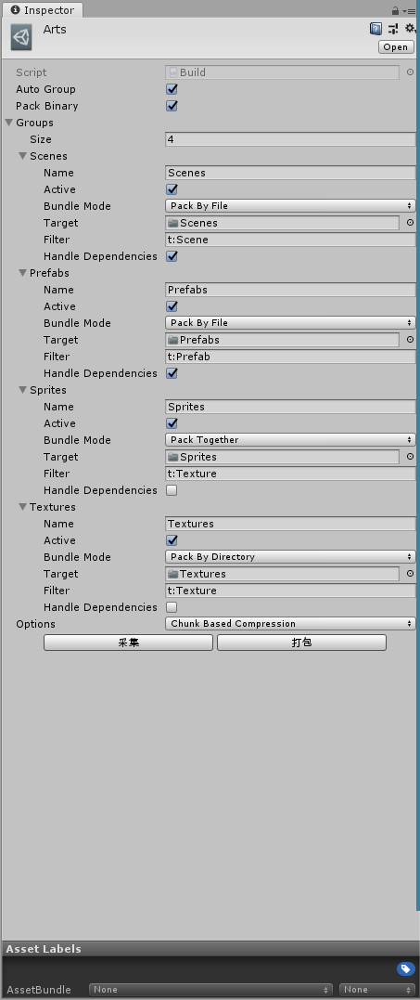

2. 初始化，短链接配置、自动更新配置、闪屏

   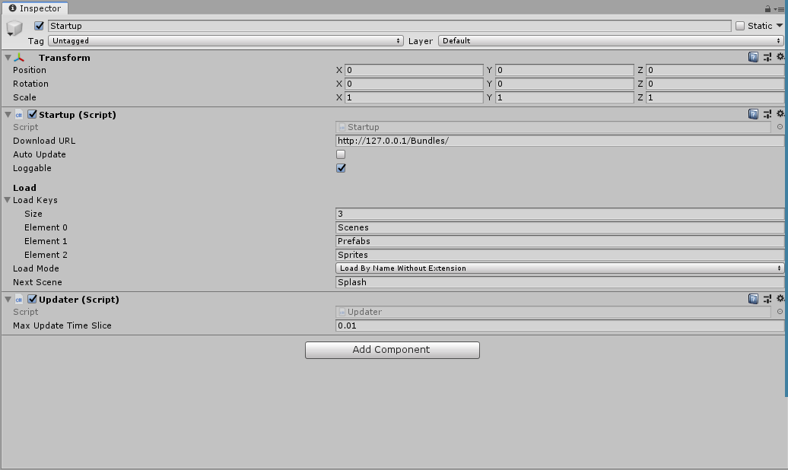 
   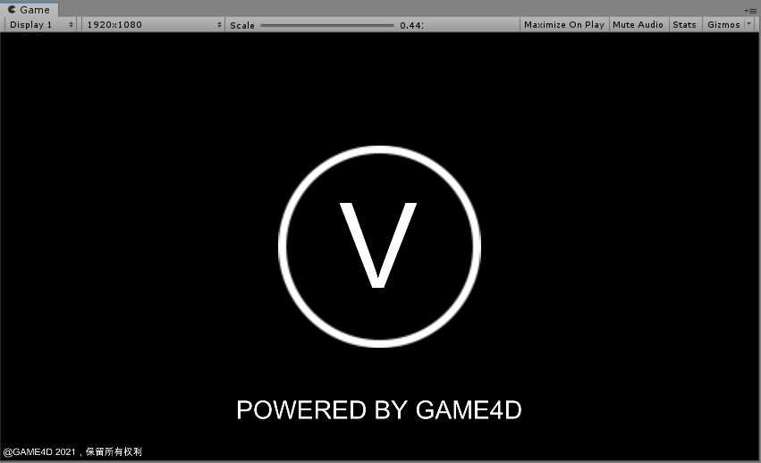

3. 欢迎使用，更新版本信息，局部按需更新

   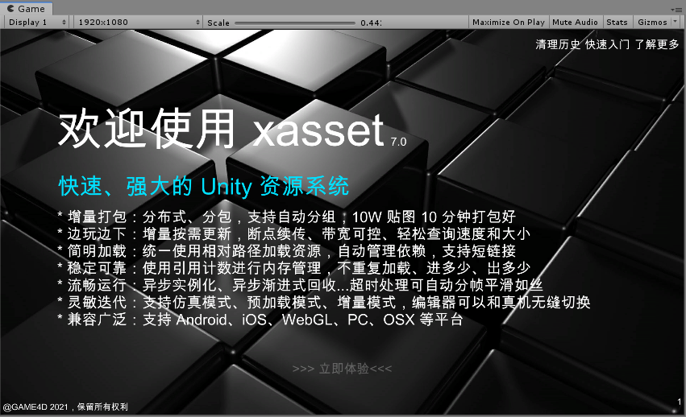
   
4. 菜单，提供了循环依赖资源加载更新、异步转同步加载更新、叠加场景加载更新、下载解压等功能的演示

   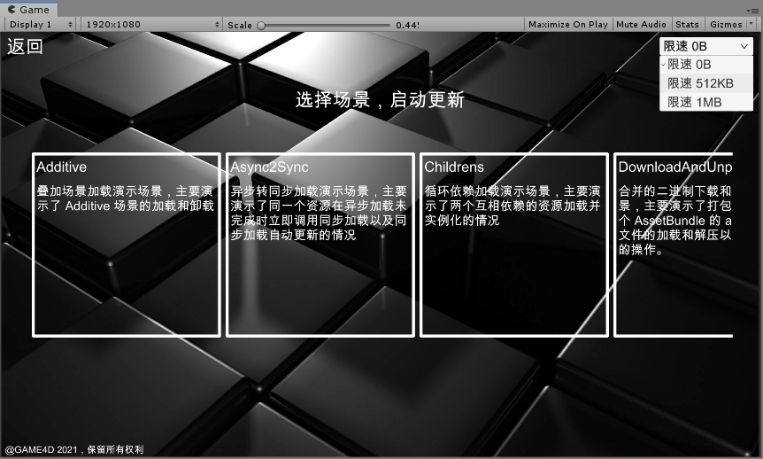
   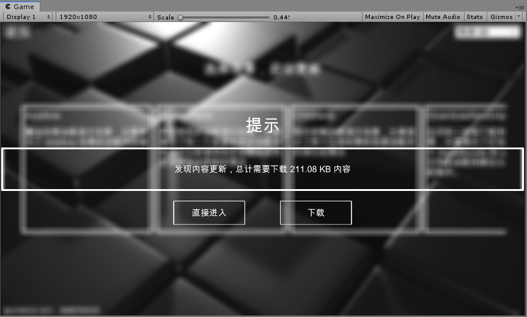
   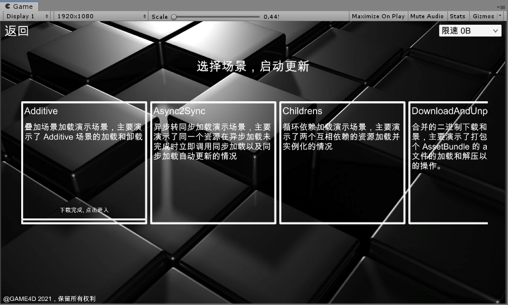

5. 叠加场景加载和更新

   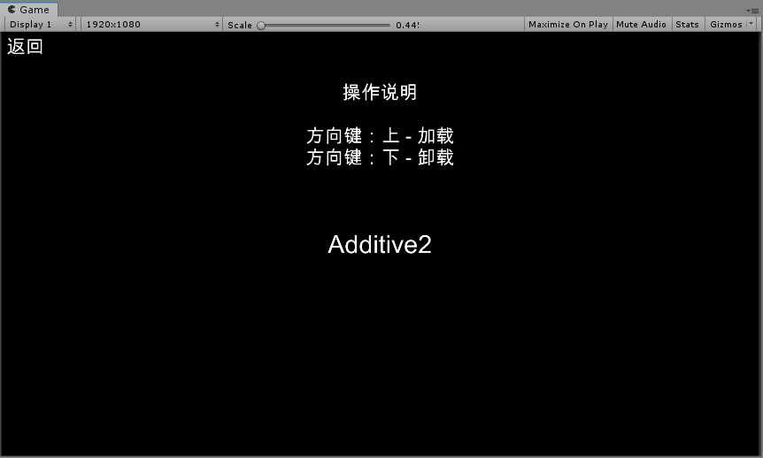

6. 循环依赖加载和更新

   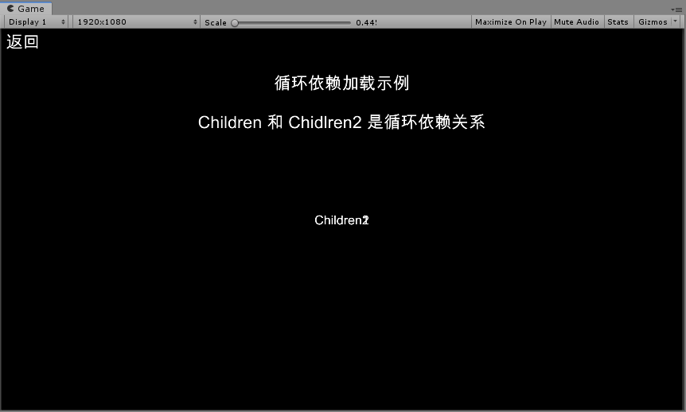

7. 异步转同步加载和更新

   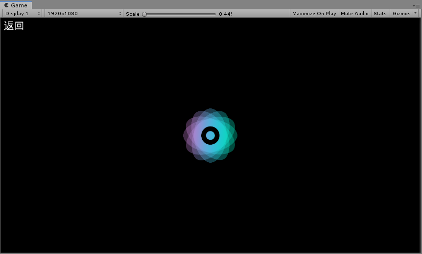

8. 支持限速的下载解压功能

   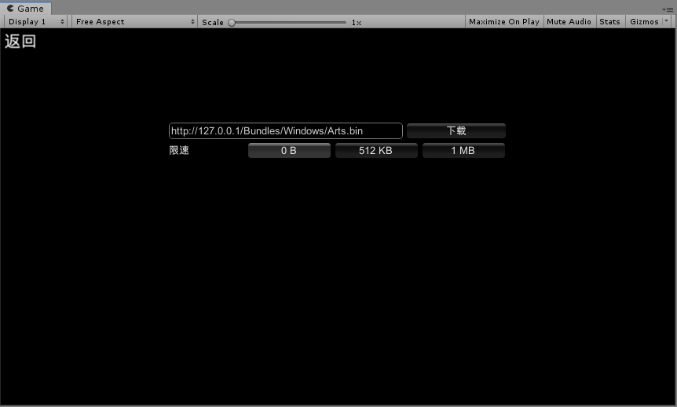

## 历史

从开源版本到商业化，xasset 已经持续迭代了近 5 年，通过持续不断的自我迭代和突破 xasset 项目达成了：

- 1.4k+ 星标的开源项目（1.0-4.x）
- 160+ 个人和团队付费订阅（5.1-6.1）
- 25+ 团队付费订阅（持续增长 6.1）
- 1k+ 用户的行业内容交流群（持续增长）
- 15+ 次创作赞助扶持（持续投入）

## 了解更多

- 有关 xasset 的疑问或建议，请加作者微信号 vmakemore 反馈。

## 技术支持

团队订阅的用户可以在专属对接群留言，个人用户可以先查阅文档或是[点击链接加入群聊【GAME+】](https://jq.qq.com/?_wv=1027&k=7DpHQNhb)给群主留言。
