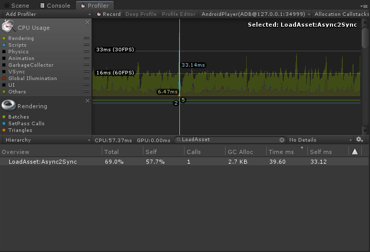

<!-- docs/binarymode.md -->
## 安装包资源加密

xasset-7.0 使用了最高效的资源加密方式来防止资源轻易被 AssetStudio 之类的工具破解。以下是加载同一个资源加密前后的 CPU 耗时和 GC 的真机 Profiler 采样数据：

|        | CPU（MS） | GC（KB） |
| ------ | ----------- | -------- |
| 加密   | 30.15       | 2.5      |
| 未加密 | 33.12       | 2.7      |

> 注：测试设备为 Song XZs，Android 8.0。

加密版本的 Profiler 采样截图如下： 

  

未加密版本的 Profiler 采样截图如下：

  

以下是测试的代码片段：

```C#
public void Load()
{
    const string assetPath = "Logo";
    var assetType = typeof(Sprite);
    Profiler.BeginSample("LoadAsset:Async2Sync");
    _assets.Add(Asset.LoadAsync(assetPath, assetType));
    var asset = Asset.Load(assetPath, assetType);
    image.sprite = asset.Get<Sprite>();
    Profiler.EndSample();
    image.SetNativeSize();
    _assets.Add(asset);
}
```

要使用安装包加密功能，仅需在 Settings 中勾选 BinaryMode 就可以开启这个功能，如下图：

  

