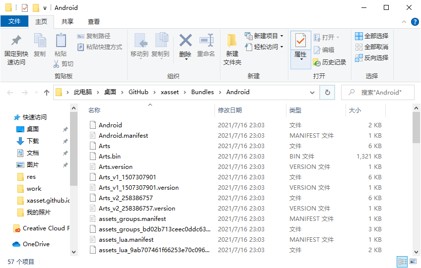

<!-- docs/buildevent.md -->
## 打包事件

打包事件主要包括：

- BuildScript.postprocessBuildBundles：打包后触发的事件。
- BuildScript.preprocessBuildBundles：打包前触发的事件。

以下是通过打包事件获取当前 Build 中，新增文件的示例代码：

```c#
[InitializeOnLoad]
public static class ExampleBuildProcessor
{
    static ExampleBuildProcessor()
    {
        BuildScript.postprocessBuildBundles += PostprocessBuildBundles;
        BuildScript.preprocessBuildBundles += PreprocessBuildBundles;
    }

    private static void PreprocessBuildBundles(BuildTask task)
    {
        Debug.LogFormat("PreprocessBuildBundles {0}", task.name);
    }

    private static void PostprocessBuildBundles(BuildTask task)
    {
        Debug.LogFormat("PostprocessBuildBundles {0}", task.name);

        var record = task.record;
        if (record == null)
        {
            return;
        }
        
        // 本次 Build 中新增的文件
        foreach (var file in record.files)
        {
            Debug.Log(file);
        }
    }
}
```

打包完成后，默认会将打包的所有文件输出到当前平台的 Bundles 目录下，如下图：



每次打包后需要上传到服务器的文件都记录到了后处理的 Record 中。