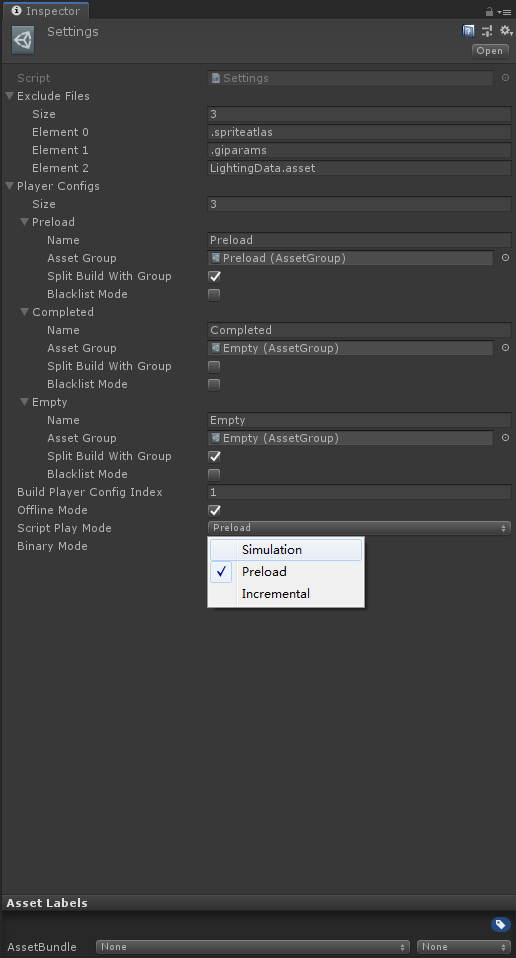
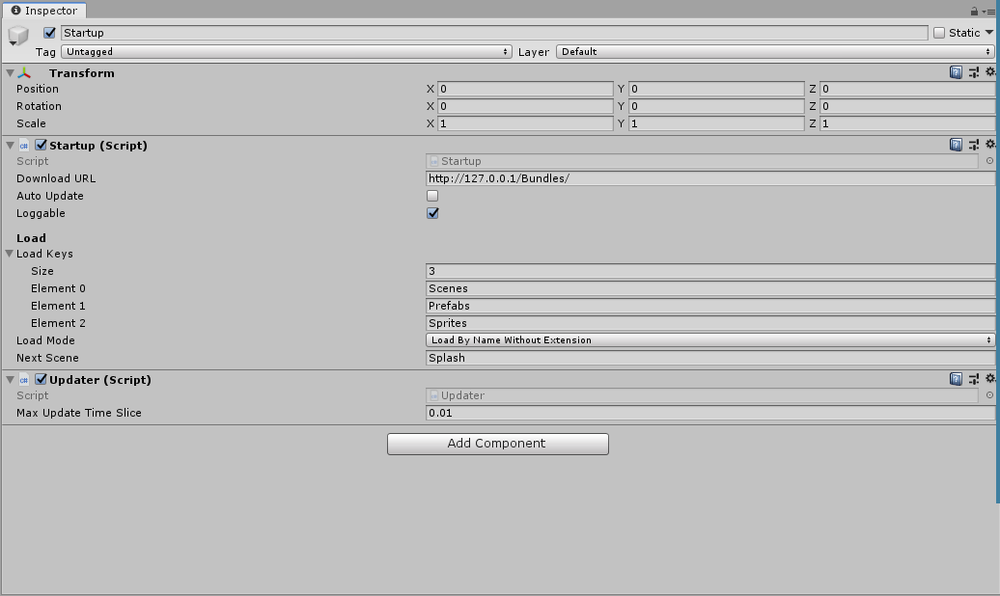
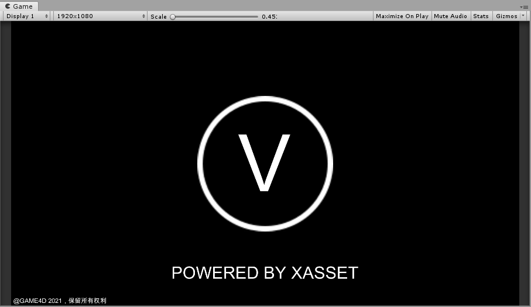
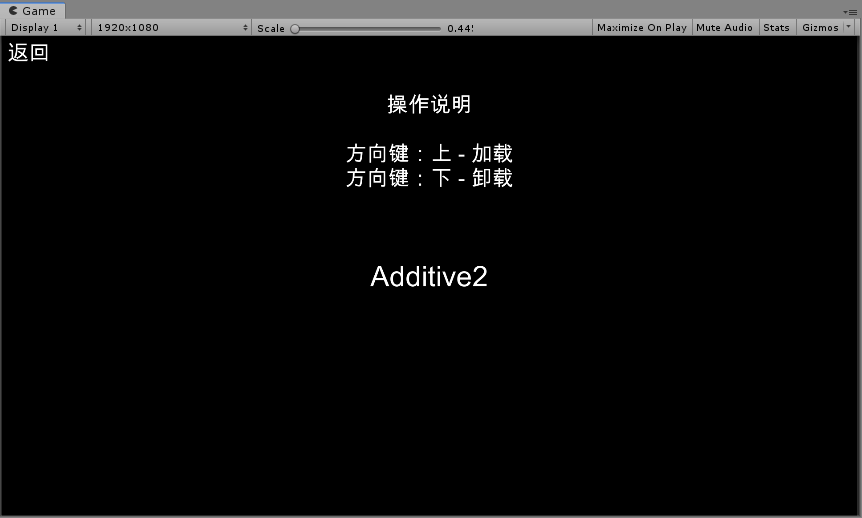
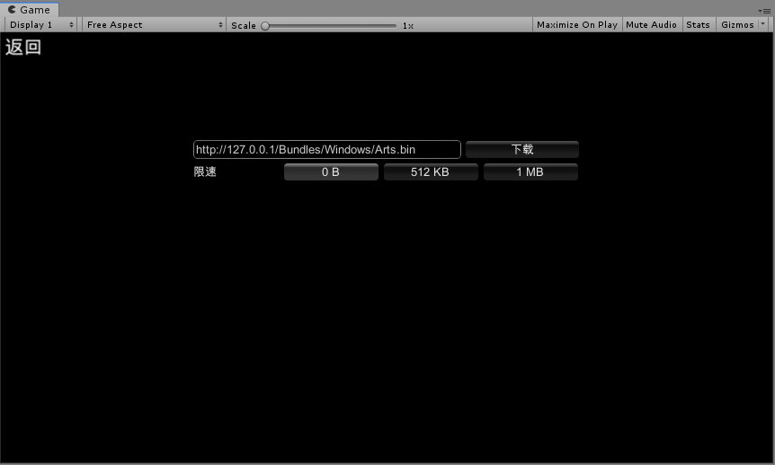

<!-- docs/example.md -->
## 示例说明

xasset-7.0 的示例主要包含以下特性的演示：

1. 分布式、分包打包配置（完整资源、不带资源、部分资源）

   
   

2. 初始化，短链接配置、自动更新配置、闪屏

    
   

3. 欢迎使用，更新版本信息，局部按需更新

   
   
4. 菜单，提供了循环依赖资源加载更新、异步转同步加载更新、叠加场景加载更新、下载解压等功能的演示

   
   
   

5. 叠加场景加载和更新

   

6. 循环依赖加载和更新

   

7. 异步转同步加载和更新

   

8. 支持限速的下载解压功能

   