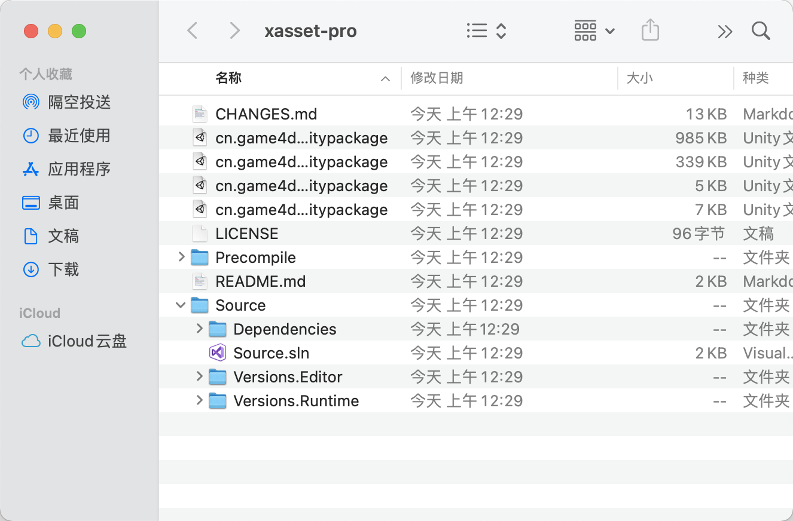

<!-- docs/structure.md -->

## 工程结构

xasset 7.0 的工程主要包含以下部分：

- Assets/Versions 源码
- Assets/Versions.Examples 示例
- Assets/Versions.PAD Android App Bundle 的适配 （仅限团队用户）
- Assets/Versions.XLua XLua 的对接（仅限团队用户）
- Assets/Settings.asset 编辑器配置
- Assets/Resources/PlayerSettings.asset 记录了安装包内的文件的配置
- Bundles 打包后的输出目录
- AssetPacks 资源临时目录

可其他版本不同，团队版本还提供了独立于 Unity 的源码工程，如下图：

要在项目中使用 xasset-7.0，主要有这些方式：

- 直接导入 unitypackage 到需要使用的项目。
- 把源码工程目录复制到目标工程的 Assets 目录的同级，编译源码工程的解决方案后，会自动生成dll输出到 Assets/Versions 目录下。
- 直接把 Precompile 的 Versions 文件夹拖拽到目标工程的 Assets 目录下。

